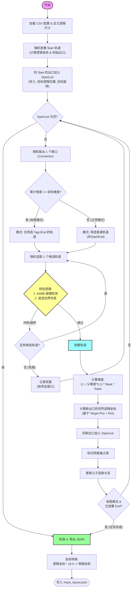

# Maze Generation Algorithm Flowchart

本文档描述了 `maze_generator.py` 的核心执行逻辑。算法采用 **难度驱动 (Difficulty-Driven)** 和 **全逻辑坐标 (Logical Coordinates)** 策略。

```mermaid
flowchart TD
    %% =======================
    %% 阶段 1: 初始化
    %% =======================
    Start(["开始"]) --> LoadConfig["加载 CSV 配置 & 定义逻辑尺寸"]
    LoadConfig --> PlaceStart["随机放置 Start 轨道<br/>(计算逻辑坐标 & 初始出口)"]
    PlaceStart --> UpdateOpenList["将 Start 的出口加入 OpenList<br/>(存入: 目标逻辑位置, 目标旋转)"]

    %% =======================
    %% 阶段 2: 生成主循环
    %% =======================
    UpdateOpenList --> LoopStart{"OpenList 为空?"}
    
    %% 分支: 结束与导出
    LoopStart -- "是" --> ExportJSON["阶段 4: 导出 JSON"]

    %% 分支: 继续生成
    LoopStart -- "否" --> PopConn["随机取出 1 个接口 (Connector)"]
    PopConn --> CheckDiff{"累计难度 >= 目标难度?"}

    %% 筛选逻辑 (Mode Selection)
    CheckDiff -- "是 (收尾模式)" --> ModeEnd["模式: 仅筛选 Tag=End 的轨道"]
    CheckDiff -- "否 (正常模式)" --> ModeNormal["模式: 筛选普通轨道<br/>(非Start/End)"]

    %% 尝试连接 (Connection Attempt)
    ModeEnd --> PickCand["随机选取 1 个候选轨道"]
    ModeNormal --> PickCand
    
    PickCand --> CheckValid{"校验逻辑:<br/>1. AABB 碰撞检测<br/>2. 迷宫边界检查"}

    %% 校验结果处理
    CheckValid -- "冲突/越界" --> TryNext{"还有候选轨道?"}
    TryNext -- "是" --> PickCand
    TryNext -- "否 (死路)" --> LogDead["记录死路<br/>(放弃此接口)"] --> LoopStart

    %% =======================
    %% 阶段 3: 放置与更新
    %% =======================
    CheckValid -- "通过" --> PlaceRail["放置轨道"]
    
    PlaceRail --> CalcDiff["计算难度:<br/>(1 + 父难度*0.1) * Base * Ratio"]
    CalcDiff --> BakeExits["计算新出口的世界逻辑坐标<br/>(基于 Target Pos + Rot)"]
    BakeExits --> AddToOpenList["将新出口加入 OpenList"]
    AddToOpenList --> MarkOccupied["标记网格被占用"]
    MarkOccupied --> UpdateTopology["更新父子连接关系"]

    %% 循环回归
    UpdateTopology --> LoopCheckEnd{"收尾模式 &<br/>已放置 End?"}
    LoopCheckEnd -- "是 (任务完成)" --> ExportJSON
    LoopCheckEnd -- "否" --> LoopStart

    %% =======================
    %% 阶段 4: 导出
    %% =======================
    ExportJSON --> ConvertCoords["坐标转换:<br/>逻辑坐标 * 16.0 -> 物理坐标"]
    ConvertCoords --> WriteFile(["写入 maze_layout.json"])

    %% 样式定义
    style Start fill:#f9f,stroke:#333,stroke-width:2px
    style ExportJSON fill:#9f9,stroke:#333,stroke-width:2px
    style CheckValid fill:#ff9,stroke:#333,stroke-width:2px
    style PlaceRail fill:#9ff,stroke:#333,stroke-width:2px
```
